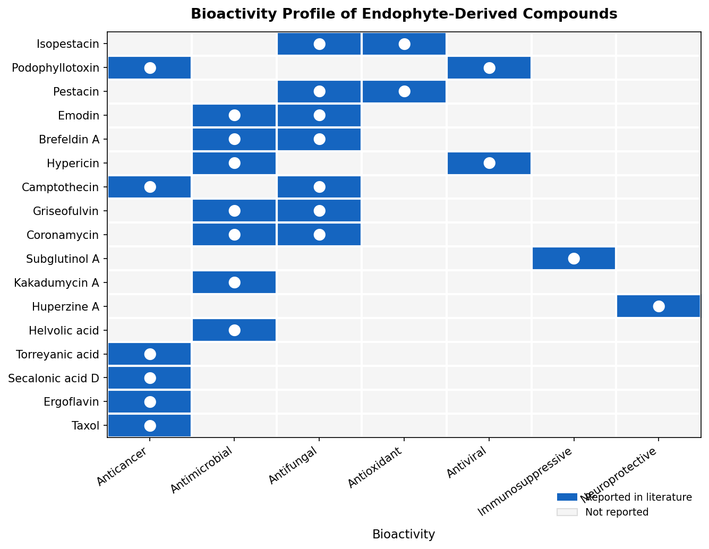
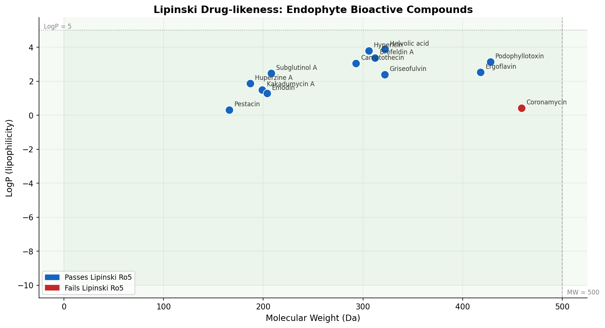
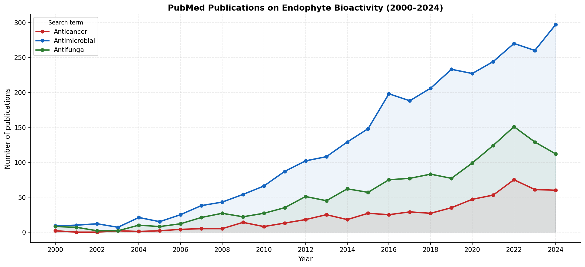

# Endophyte Bioactive Compounds — Computational Analysis

A bioinformatics project bridging microbiology and data science to computationally analyse bioactive secondary metabolites produced by endophytic microorganisms.

Inspired by a literature review on *Endophytes as a Treasure Trove of Bioactive Molecules* (Amity University, 2019), this project applies cheminformatics and data analysis to evaluate endophyte-derived compounds as potential drug candidates.

---

## Background

Endophytes are microorganisms (fungi, bacteria) that live asymptomatically inside plant tissues. They produce a remarkable diversity of bioactive secondary metabolites — many of which have become foundational drugs:

- **Taxol (Paclitaxel)** — from *Taxomyces andreanae*, now a frontline anticancer drug
- **Camptothecin** — from *Fusarium solani*, precursor to topotecan and irinotecan
- **Podophyllotoxin** — precursor to etoposide and teniposide

This project asks: *which of these compounds have the best drug-like properties, and what does the research landscape look like computationally?*

---

## Project Structure

```
endophyte-drug-discovery-analysis/
│
├── README.md
├── requirements.txt
│
├── data/
│   ├── compounds.csv
│   └── pubmed_trends.csv
│
├── notebooks/
│   ├── 01_data_curation.ipynb
│   ├── 02_lipinski_filter.ipynb
│   ├── 03_pubmed_trends.ipynb
│   ├── 04_bioactivity_heatmap.ipynb
│   └── 05_network_graph.ipynb
│
└── figures/
    ├── compound_overview.png
    ├── lipinski_scatter.png
    ├── lipinski_heatmap.png
    ├── bioactivity_heatmap.png
    ├── pubmed_trends.png
    └── network_graph.html

---

```
## Modules

### Module 1 — Data Curation (`01_data_curation.ipynb`)
- Curates 15+ endophyte-derived bioactive compounds from literature
- Fetches molecular weight, formula, SMILES, and InChIKey from **PubChem API**
- Saves structured dataset to `data/compounds.csv`

### Module 2 — Drug-likeness Analysis (`02_lipinski_filter.ipynb`)
- Computes Lipinski's Rule of Five descriptors using **RDKit**
  - Molecular weight, LogP, H-bond donors, H-bond acceptors
- Flags compounds passing/failing oral drug-likeness criteria
- Visualises results as a radar/scatter plot

### Module 3 — PubMed Trend Analysis (`03_pubmed_trends.ipynb`)
- Queries **NCBI E-utilities (Biopython Entrez)** for annual publication counts
- Search terms: `endophyte + anticancer`, `endophyte + antimicrobial`, `endophyte + antifungal`
- Plots research growth from 2000–2024

### Module 4 — Bioactivity Heatmap (`04_bioactivity_heatmap.R`)
- Cross-tabulates compounds vs. bioactivity categories
- Plots binary heatmap using **ggplot2 / pheatmap**

### Module 5 — Biological Network Graph (`05_network_graph.ipynb`)
- Builds a directed network graph: Host Plant → Endophyte → Compound → Bioactivity
- Maps 16 relationship chains across 4 node types
- Built with **NetworkX** and **Plotly** for interactive visualisation
- Hover over nodes to explore connections

---

## Setup

```bash
git clone https://github.com/shrutibanerjee/endophyte-bioactives-analysis.git
cd endophyte-bioactives-analysis
pip install -r requirements.txt
```

For the R notebook, open in RStudio and install packages as prompted.

---

## Key Findings

### Bioactivity Profile


### Drug-likeness Analysis (Lipinski Ro5)


### Research Growth Trend (PubMed)


### 🔗 Biological Network Graph
[Click here to view the interactive network graph](https://htmlpreview.github.io/?https://github.com/shruti-banerjee/endophyte-drug-discovery-analysis/blob/main/figures/network_graph.html)

*Hover over nodes to explore connections. Click legend to filter node types.*

---

## Skills Demonstrated

`Python` `R` `RDKit` `Biopython` `PubChem API` `NCBI E-utilities` `pandas` `ggplot2` `cheminformatics` `data visualisation` `literature mining` `NetworkX` `Plotly` `network analysis` `interactive visualisation`

---

## References

1. Strobel & Daisy (2003). Bioprospecting for microbial endophytes. *Microbiology and Molecular Biology Reviews*, 67(4), 491–502.
2. Tan & Zou (2001). Endophytes: a rich source of functional metabolites. *Natural Product Reports*, 18.
3. Wani et al. (1971). The isolation and structure of taxol. *Journal of the American Chemical Society*, 93(9).

---

*Author: Shruti Banerjee | MSc Bioinformatics, Pondicherry University*
